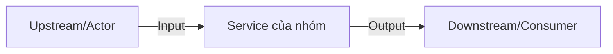

# Service boundary (minimal submission)

Actor: User, System

Boundary: This document describes the service boundary for the example mini-stack.

Service: Example Web Service (nginx) + Local Registry

Input: HTTP requests on port 8081, Docker push/pull to registry on 5000

Output: HTTP responses, hosted images in local registry

API: HTTP endpoints proxied by nginx; registry HTTP API at /v2/

Responsibilities:

- Serve static content and proxy requests.
- Provide a local Docker registry for teaching and testing.

Out of scope:

- Persistent databases, monitoring, and production deployments.

ASCII diagram:

User --> [nginx (Service)] --> upstream services
User --> [registry (Provider)]
# Service Boundary

## 1. Tên Service

## 2. Bài toán Service giải quyết

## 3. Actor

## 4. Responsibility

## 5. Out of scope

## 6. Input

| Field | Type | Required | Ý nghĩa |
|---|---|---|---|

## 7. Output

## 8. Provider / Consumer

## 9. Upstream / Downstream

## 10. API dự kiến

## 11. Event dự kiến

## 12. Boundary Diagram

## 13. Vấn đề cần đàm phán ở Buổi 2
1.
2.
3.
